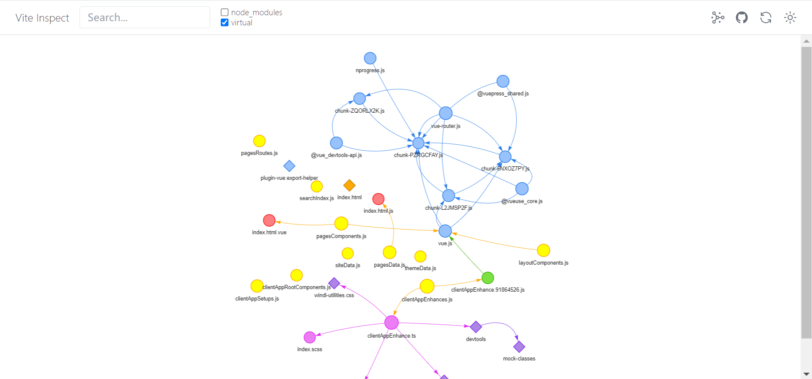

# vuepress-docs-template

基于 `vuepress-next` 的文档模板 👍


<br />
<br />

## 动机 🦖

为了快速书写漂亮的开源产品文档！！

<br />
<br />

## 特性 🦕

1. Api 自动引入
2. 路径别名支持
3. unocss 支持
4. 漂亮的 404 页支持
5. 按需自动引入组件支持 (支持 `naive-ui`)
6. Inspect 调试支持


<br />
<br />

## 克隆 🐸


1. Github

```shell
git clone git@github.com:dishait/vuepress-docs-template.git
```

2. Gitee

```shell
git clone git@gitee.com:dishait/vuepress-next-template.git
```

<br />
<br />

## 使用 🐂

1. install

```shell
yarn i
```

2. dev

```shell
yarn dev

# yarn dev:open
```

3. build

```shell
yarn build
```

<br />
<br />

## 详情 🐳

### [1. Api 自动引入](https://github.com/antfu/unplugin-auto-import)

原本 `vue` 的 `api` 需要自行 `import`。
```ts
import { ref, computed } from 'vue'
const count = ref(0)
const doubled = computed(() => count.value * 2)
```
现在可以直接使用。
```ts
const count = ref(0)
const doubled = computed(() => count.value * 2)
```
而且上边的 `api` 是按需自动引入的。

目前模板支持自动引入 `api` 的库列表包括:
1. vue
2. vueuse
3. vue-router

<br />
<br />

### 2. 路径别名支持

`~` 将直接导向 `docs`，而 `~u` 将导向 `docs/.vuepress/composables`


<br />
<br />

### 3. [unocss 支持](https://github.com/unocss/unocss)

`unocss` 是一个开发中速度更快的 `原子css` 库。

直接就可以在 `markdown` 中使用，例如 👇

```markdown

# 我是一个 markdown

<div class="bg-red-500">你好，我是应用了红色的元素</div>
```

于是将渲染红色的元素 👍

具体可见👉 [unocss](https://github.com/unocss/unocss)


<br />
<br />

### 4. 漂亮的 `404` 页支持

在日常业务中，当用户访问不存在的页面时，应该给到我们的用户一个不存在的信息提示，而这个提示的页面就是 `404` 页。

你可以随便访问一个不存在的页面，例如 `/bucunzai`


当然还有暗黑模式适应。


也支持简单的响应式适应。例如移动端浏览器上会有正确的显示。

当然如果这个 `404` 的封面不符合你的口味，那么可以在 `docs/.vuepress/theme/layouts/404.vue` 中修改 `img` 标签的 `src`。默认是 `33.svg`，支持 `1 ~ 33` 的 `svg`。

例如，默认 👇

```html
<!-- 省略各种代码 -->
<template>
    
</template>
```

修改 `/404/33.svg` 为 `/404/32.svg`

```html
<!-- 省略各种代码 -->
<template>
    
</template>
```
即可切换封面为 👇


<br />
<br />


### [5. 组件自动引入](https://github.com/antfu/unplugin-auto-import)

原来需要 `import`
```markdown
<!-- markdown 中 -->

<script setup lang="ts">
    import Hello from "../components/Hello.vue"
</script>

<Hello />
```

现在只要在 `.vuepress/components` 下定义的组件都将会按需引入，即 `import` 是不需要的。

```html
<!-- markdown 中 -->

<Hello />
```

同时流行组件库自动引入也是支持的，例如 `Naive ui`。

只需安装依赖。

```shell
yarn add naive-ui -D
```
即可在 `markdown` 中使用。

```markdown
<!-- markdown 中 -->

<n-button type="success">Success</n-button>
```
目前支持的组件库有:

- [naive ui](https://www.naiveui.com/zh-CN/os-theme)


<br />
<br />

### [6. Inspect 调试支持](https://github.com/antfu/vite-plugin-inspect)

启动项目
```shell
yarn dev
```
可以看到一个 `url`


先进入 `http://localhost:3000`，再进入 `http://localhost:3000/__inspect/` 即可获得依赖图谱。



通过顶部的一些按钮还可以调整依赖呈现。

具体可见 👉 [vite-plugin-inspect](https://github.com/antfu/vite-plugin-inspect)

<br />
<br />

## 更多 🐃

由于该模板是基于 `vuepress-next` 搭建而来，如果你希望了解更多的知识，可见 👉 [vuepress-next](https://v2.vuepress.vuejs.org/zh/)


<br />
<br />

## 组织 🦔

欢迎关注 **帝莎编程**
- [官网](http://dishaxy.dishait.cn/)
- [Gitee](https://gitee.com/dishait)
- [Github](https://github.com/dishait)
- [网易云课堂](https://study.163.com/provider/480000001892585/index.htm?share=2&shareId=480000001892585)

<br />
<br />

## License

Made with [markthree](https://github.com/markthree)

Published under [MIT License](./LICENSE).